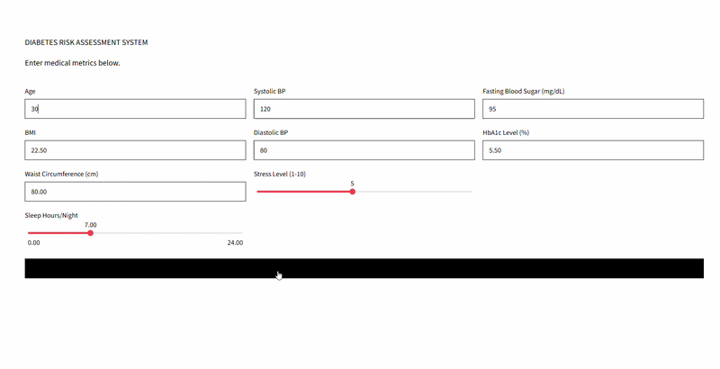

# Diabetes Risk Assessment System

End-to-End Machine Learning web application built for assessing diabetes risk levels based on clinical and body metrics, styled with a raw, minimalist UI.

## Badges
[](https://www.hcmus.edu.vn/)
[](https://www.hcmus.edu.vn/)
[](https://www.python.org/)
[](https://scikit-learn.org/)
[](https://www.kaggle.com/)
[](https://scikit-learn.org/)

> **⚠️ DISCLAIMER:** This repository is intended for educational and personal portfolio purposes only. It is **not** a substitute for professional medical advice, diagnosis, or treatment. If you feel unwell or experience any symptoms, please consult a qualified healthcare provider immediately instead of browsing GitHub.

## Demo Project
<p align="center">
  <!-- Insert your demo GIF here -->
  
</p>

## Note from the Author
This is my very first Machine Learning project, so the implementation, data preprocessing, and architecture are quite basic and imperfect. Please take it with a grain of salt and **do not use it as a formal reference** for production or real-world systems!

## File Structure
```text
Diabetes_Risk_Analysis/
│
├── app.py
├── diabetes_model.pkl
├── requirements.txt 
├── assets/
├── 
